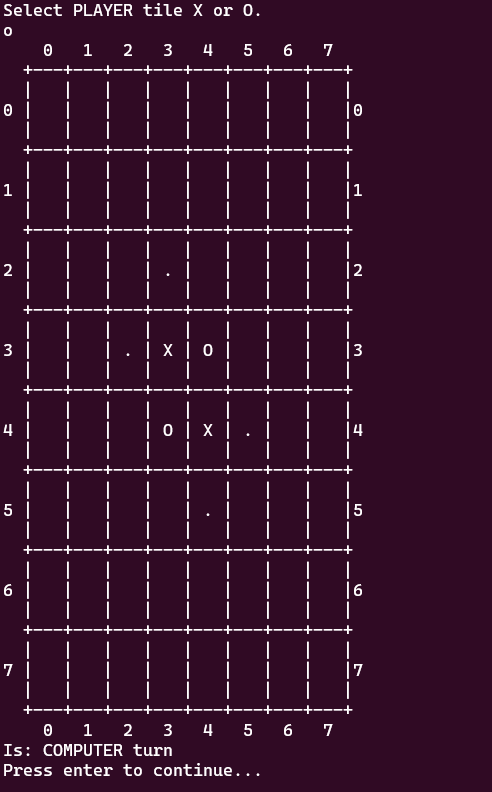

# test-reversi
### Reversi Game

```
project
│   README.md
|   CMakeLists.txt
│
+----bin
│
+----include
│
+----lib
│
+-----src
|     +-- move
|         +-- east.cpp/h
|         +-- west.cpp/h
|         +-- south.cpp/h
|         +-- north.cpp/h
|         +-- northwest.cpp/h
|         +-- southeast.cpp/h
|         +-- westsouth.cpp/h
|         +-- eastnorth.cpp/h
|     +-- CMakeLists.txt
|     +-- algo.cpp/h
|     +-- step.h
|     +-- base.cpp/h
|     +-- drawboard.cpp/h
|     +-- main.cpp/h
|     +-- movesteps.cpp/h
|     +-- player.cpp/h
|
+-----test
|
```

# To clone this Repo
```bash
git clone git@github.com:tan4575/test-reversi.git
git submodule update --init --recursive
```

# To make and build
```bash
cmake . && cmake --build .
./src/reversi
```
# Demo

